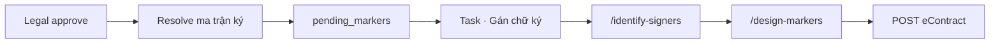
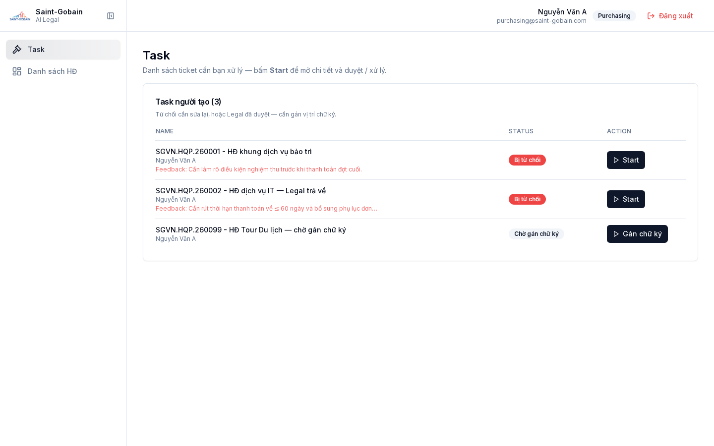
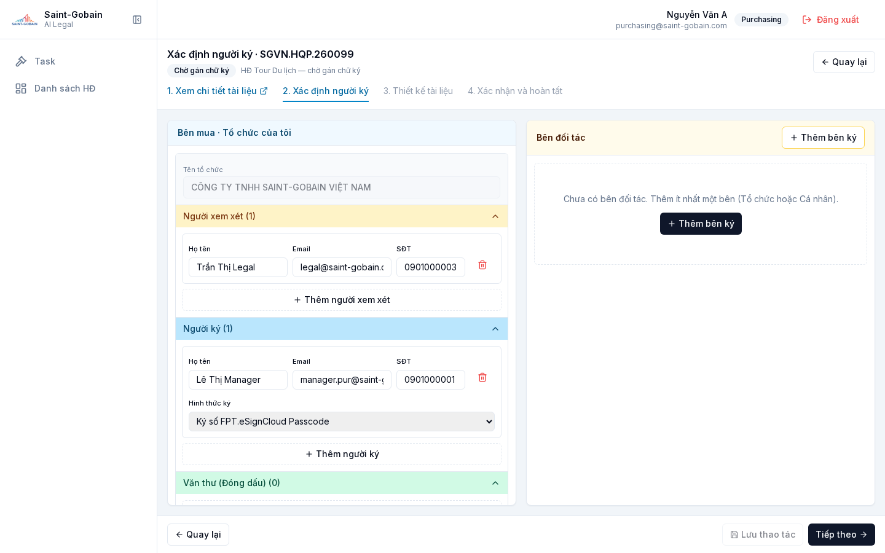
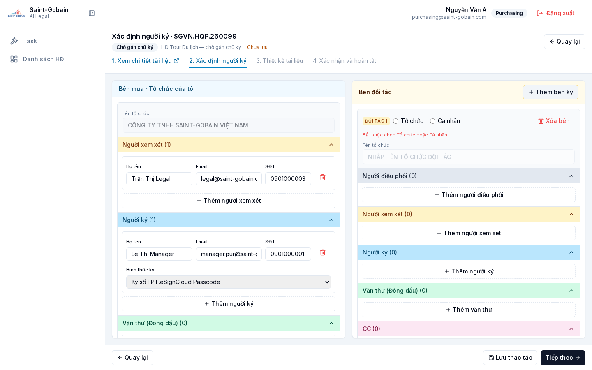
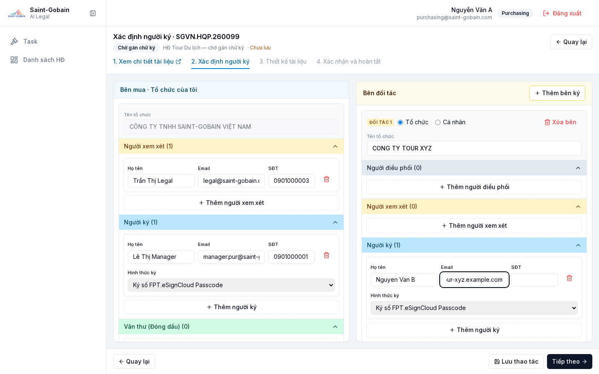
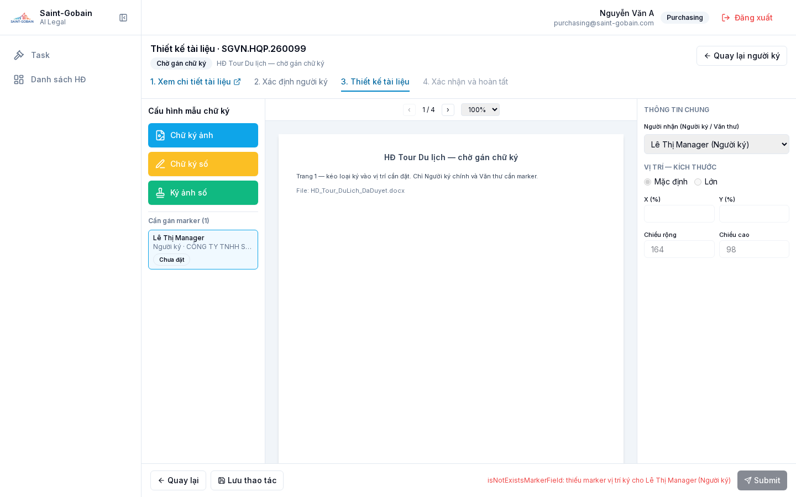

# AI Legal

> Nguồn yêu cầu: `Tom_tat_yeu_cau_AI_Review_Hop_dong_Rev12.docx` · Blueprint: `docs/SGB_AILegal_Blueprint_Sprint1.docx` (**v1.28**)

Trợ lý AI nội bộ (**AI Legal**) giúp **phòng Mua hàng** tự rà soát và hoàn thiện hợp đồng nháp (`.docx`) trước khi **Purchasing Manager → Legal** phê duyệt trong hệ thống, rồi **đồng bộ sang FPT.eContract** để trình ký.

> Kết quả AI chỉ là gợi ý — không thay thế rà soát pháp lý chính thức.

## Mục tiêu

- Đối chiếu điều khoản **bắt buộc / cấm / khuyến nghị** theo từng loại hợp đồng
- Đề xuất chỉnh sửa kèm **giải thích** và **% độ tin cậy AI** (+ **Fairness Score** riêng)
- **3 phương thức chỉnh sửa** song song: Chat AI (mặc định) · sửa trực tiếp inline trong hệ thống · tải xuống → sửa Word → upload lại
- Tôn trọng cấu trúc khoá Word (Restrict Editing / Range Permission / Content Control)
- Legal **approve / reject** (reject kèm Structured Feedback: Comment và/hoặc Track Changes trên vùng mở)
- Interface với **Econtract** (đẩy trình ký một chiều qua API + nhận file đã ký về qua **sFTP**/callback)

## Vai trò

| Vai trò | Quyền / trách nhiệm |
|---------|---------------------|
| **Purchasing** | Khởi tạo + Submit duyệt; hoặc **Review hợp đồng** (chỉ AI review, không duyệt); sau Legal: **Gán chữ ký**; chỉ thấy HĐ của mình |
| **Purchasing Manager** | Duyệt HĐ subordinate (Approve/Reject cơ bản Sprint 1); Approve → Legal |
| **Legal** | Checklist loại HĐ (Sửa + Lưu); duyệt `pending_legal`; Approve → `pending_markers` (không đẩy eContract ngay) |
| **IT** | Triển khai LLM Local, app, tích hợp; Configurations (Form lists / **Phân quyền ký** / System Prompt); Users + tick phân quyền |
| **eContract** | Hệ thống trình ký FPT — outbound API + callback/sFTP nhận file đã ký |

## Phạm vi

- **2 nhóm HĐ:** Hợp đồng khung (bắt buộc khớp template chuẩn) và Hợp đồng NCC/khác (không bắt buộc khớp 100%)
- Loại chưa có checklist chi tiết: vẫn chọn được; AI review theo lớp ngữ nghĩa chung + cảnh báo *tham khảo*
- Kiến trúc: app mới; tích hợp **API một chiều** với Econtract; chiều nhận hợp đồng đã ký về qua **sFTP**
- Đầu ra: `.docx` hoàn thiện, **giữ format** giống file input
- Khối lượng: vài trăm HĐ/tháng → **Processing Queue**
- Model: **LLM Local** (không dùng cloud); fallback rule-based nếu LLM sự cố

## Workflow tổng quát

```
Purchasing input → Queue → AI handle → Submit duyệt
  → pending_manager (nếu có Line Manager) → pending_legal
  → (reject: Structured Feedback → chỉnh sửa, version mới)
  → Legal approve → resolve ma trận Phân quyền ký (bên mua)
  → pending_markers (Task người tạo · nút Gán chữ ký)
  → Bước 1: Xác định người ký (buyer auto + thêm đối tác)
  → Bước 2: Thiết kế tài liệu (kéo-thả marker · chỉ Ký chính + Văn thư)
  → Submit → Word+marker mực trắng → PDF → base64 → POST FPT.eContract
  → syncing_econtract → signed (callback / sFTP)
```

## Số tài liệu (Document number)

Tự sinh khi tạo / lưu nháp — **user không sửa được** (field read-only, không ghi chú phụ trên UI).

- **Format:** `(Mã công ty).(Mã loại hợp đồng).NămYY + STT`  
  Ví dụ: `VTS.HQP.260001`
- **Mã công ty** = `businessEntities.code` (Form lists → Công ty)
- **Mã loại hợp đồng** = `documentCategories.code` (Form lists → Loại hợp đồng / Contract category, vd HQP, RAW, LOG)
- **STT** tăng theo **từng công ty** trong năm (không phụ thuộc loại HĐ)

### Thứ tự field form Tạo tài liệu (rút gọn)

1. Loại hợp đồng → 2. Tên hợp đồng → **3. Công ty** → 4. Tên tài liệu → 5. Số tài liệu (tự sinh) → 6. Ngày ký → 7. Loại giá trị HĐ → 8. Hợp đồng tiêu chuẩn → 9–11. Chiết khấu / giá trị → Upload

## Review hợp đồng (menu sidebar)

Luồng **chỉ AI review** — không Submit duyệt, không Task, không eContract.

| Bước | Màn / route | Nội dung |
|------|-------------|----------|
| 1 | Sidebar **Review hợp đồng** → `/dashboard/review` | Bắt buộc: **Loại hợp đồng** + **Tên hợp đồng**; upload **1 file** `.docx` |
| 2 | `/dashboard/review/[id]` | Workspace: **Chat với AI** + xem/chỉnh tài liệu (Accept/Undo, diff, insight) → **kết thúc** |
| — | Muốn duyệt / trình ký | Dùng **Tạo tài liệu** (`/dashboard/contracts/new`) + luồng Submit → Manager → Legal → wizard ký |

- Intake còn lại (Công ty, số tài liệu, …) hệ thống **điền mặc định** khi tạo ticket review.
- Checklist AI theo loại giá trị HĐ mặc định (loại published có checklist).

## Luồng người dùng

1. **Khởi tạo** — **Tạo tài liệu** full form (để duyệt/eContract), hoặc **Review hợp đồng** (chỉ AI review). Số tài liệu tự sinh khi đủ Công ty + Loại hợp đồng  
   - HĐ NCC/khác: quét vùng mở theo thứ tự **Range Permission** (`w:permStart`/`w:permEnd`) → Content Control → Legacy Form Field
2. **AI xử lý** — Processing Queue; đề xuất **Loại A** (vùng mở) / **Loại B** (vùng khoá)
3. **Workspace AI** — Chat | tài liệu reviewed (% tin cậy + diff) — PT1 Chat thuộc Sprint 1; **PT2/PT3 ngoài phạm vi**  
   - Loại A: undo/accept từng dòng hoặc cả file  
   - Loại B: chỉ cảnh báo/annotation (không ghi đè)  
   - Chat cập nhật diff realtime; badge % tin cậy mở popup phân tích  
4. **Gửi duyệt** (chỉ luồng Tạo tài liệu) — Submit → Task Manager (nếu có Line Manager) rồi Legal (**không** bắt buộc marker ở bước này)  
   - Reject → chỉnh sửa → resubmit (version mới); UI TH1/TH2/TH3 chi tiết **ngoài phạm vi** Sprint 1  
   - Legal Approve → resolve **ma trận Phân quyền ký** → `pending_markers` + Task về **người tạo**
5. **Gán chữ ký (wizard 2 bước sau Legal)** — xem mục chuyên sâu bên dưới

## Xác định người ký & gán marker (sau Legal approve)

Task người tạo: nút **Gán chữ ký** → wizard. Stepper:

`1. Xem chi tiết tài liệu` · `2. Xác định người ký` · `3. Thiết kế tài liệu` · `4. Xác nhận và hoàn tất`

Có thay đổi chưa lưu → phải **Lưu thao tác** trước khi mở chi tiết HĐ / thoát.

### Logic xác định người ký



| Bên | Nguồn | Role trên UI | Marker? |
|-----|--------|--------------|---------|
| **Bên mua** (trái) | Auto từ ma trận; thêm/sửa/xóa người được; **tên tổ chức read-only** | Xem xét · Ký · Văn thư · CC (**không** Điều phối) | Chỉ **Ký chính** + **Văn thư** |
| **Bên đối tác** (phải) | Nhập tay; **Thêm bên ký** nhiều bên | Điều phối · Xem xét · Ký · Văn thư · CC | Chỉ **Ký chính** + **Văn thư** |

- Đối tác **bắt buộc** chọn **Tổ chức** hoặc **Cá nhân** (`partyKind` → eContract `isOrg`).
- Thứ tự ký: **bên mua trước**, trong mỗi bên **trên → dưới** theo màn hình.
- Xem xét / Điều phối / CC: Approve / nhận thông báo — **không** in chữ ký (không marker).











### Logic gán marker (Thiết kế tài liệu)

Route: `/dashboard/contracts/[id]/design-markers`

1. Palette 3 loại: **Chữ ký ảnh** (`Sign-IMG` → `is`) · **Chữ ký số** (`sign_fca.passcode` → `ds`) · **Ký ảnh số** (`sign_ekyc` → `ds`)
2. Kéo loại ký vào trang → chọn **Người nhận** (dropdown chỉ Ký chính + Văn thư) + vị trí (X/Y %) + kích thước (Mặc định / Lớn, rộng/cao)
3. Cú pháp FPT: `#ds:id r:p_001_r_001 h:100 #` (mực trắng trong Word)
4. **Submit** chặn nếu thiếu marker cho mọi Người ký / Văn thư
5. Pipeline file: chèn marker vào `.docx` → convert **PDF** (LibreOffice nếu có; fallback `.docx`) → Base64 → Login + `excall` FPT → lưu `review.econtract` (`envelopeId`, trạng thái)


Chi tiết API / mã lỗi: [`docs/requirements-alignment/07-econtract-integration.md`](docs/requirements-alignment/07-econtract-integration.md). Credentials FPT: `ECONTRACT_*` trong `backend/.env` (xem `backend/.env.example`).

## Ba phương thức chỉnh sửa (Mục 4.7)

| | PT1 — Chat AI (**mặc định**) | PT2 — Sửa trực tiếp trong hệ thống | PT3 — Offline Word |
|--|------------------------------|-------------------------------------|--------------------|
| Cách làm | Gõ yêu cầu trong Chat; AI cập nhật diff | Bôi đen / gõ đè **inline** ngay trên Cột 3, không qua chat | Tải `.docx` → sửa Word local → **upload lại** |
| Khi nào | Đa số chỉnh sửa nội dung / số liệu | Biết chính xác vị trí & nội dung cần sửa, muốn thao tác nhanh | Cấu trúc lại nhiều điều khoản, chèn phụ lục… |
| Phạm vi | Vùng mở (chặn trước khi gọi LLM nếu ngoài allow-list) | **Chỉ vùng mở (Loại A)** theo allow-list | Cả file (nhưng vùng khoá được validate lại) |
| Version | Cập nhật trên phiên bản hiện tại | Cập nhật trên phiên bản hiện tại (re-validate realtime) | Coi là **vòng review mới** (bump version, chạy lại AI Engine) |
| Bảo vệ vùng khoá | Write-back Allow-list ở tầng code | Write-back Allow-list ở tầng code | Validate lại cấu trúc + so vùng khoá với template; template nên có mật khẩu Restrict Editing |

Cả 3 luôn khả dụng song song trong cùng phiên review (Bước 3), không ép thứ tự; mọi thay đổi ghi chung 1 audit trail có **gắn nhãn nguồn gốc** (chat / sửa trực tiếp / upload lại).

## Structured Feedback & Legal edit (Mục 4.5)

- **Comment (vùng mở + vùng khoá):** gắn theo field/đoạn (anchor kiểu `w:commentRangeStart/End`, không theo số dòng; đoạn bị xoá → comment "orphaned" vẫn hiển thị); **2 chiều** (Purchasing & Legal reply cùng thread, panel riêng); tự tổng hợp thành checklist việc cần sửa
- **Track Changes của Legal (chỉ vùng mở):** Legal tô đen → popup nhập nội dung mới (gián tiếp, khác Purchasing sửa inline) → hệ thống sinh diff đỏ/xanh **tách lớp** với diff AI; sửa luôn đi kèm **Reject** (không có sửa + approve)
- **Purchasing xử lý:** Accept (ghi giá trị Legal đề xuất) / Undo (revert bản đã submit, không cần lý do) từng dòng hoặc cả file; **không tự động resubmit** — phải bấm "Gửi Legal duyệt"
- **Version (Mục 4.5.4):** 1 bộ đếm chung tăng dần, không phân biệt actor (v1 submit → v2 Legal reject kèm sửa → v3 resubmit → …); mỗi version lưu người thao tác, hành động, diff cấp field, comment phát sinh

## Popup tin cậy & Fairness (ContractGuard-style)

Bấm badge **% tin cậy** → popup (không làm tối nền khi neo cạnh nút), gồm:

- **Độ tin cậy AI** — chắc chắn của phân tích (checklist + Approval Matrix + LLM)
- **Fairness Score** — mức cân bằng/có lợi của điều khoản cho Công ty (tách biệt; tính từ tỷ trọng Red Flag/Warning so với Protection)
- **4 nhóm phát hiện:** Red Flag · Warning · Protection · Missing Protection  
  (suy ra từ tổ hợp Loại × Mức độ nghiêm trọng của checklist — không cần field mới)
- AI tóm tắt điểm chính + field vừa đổi (cũ → mới)

## Cấu hình loại HĐ & Checklist

Mỗi loại HĐ do Legal định nghĩa: template mẫu + checklist cấu trúc + cờ “bắt buộc khớp template”.

Mỗi điều khoản checklist gồm (rút gọn): mã, tên, **Loại** (bắt buộc/cấm/khuyến nghị), **Mức độ** (Block / cảnh báo cao/thấp), **Ideal / Fallback / Red Line**, Rationale, keywords, điều kiện áp dụng, field liên kết (Range Permission/Content Control), cấp duyệt khi vượt Fallback.

- AI 2 tầng: **rule-based** (keywords) + **semantic** (LLM vs Ideal)
- Governance Sprint 1: Legal **Sửa + Lưu** trực tiếp trên UI (không Draft/Publish); audit trail cấu hình tách audit hợp đồng
- Approval Matrix (confidence): ngưỡng giá trị ↔ nhãn cấp (Manager/Director/BOD) — **Sprint 1 chỉ % tin cậy & cảnh báo**, không routing nội bộ Manager→Legal
- Import/Export Excel: ngoài scope Sprint 1 (A10)

## Phân quyền ký eContract (Configurations)

Bảng phẳng tại **Thiết lập → Configurations → tab Phân quyền ký** (`/dashboard/configurations?tab=signing`).

Mỗi dòng quy tắc:

| Cột | Ý nghĩa |
|-----|---------|
| Công ty | Multi-select từ Form lists (hiển thị mã ngăn cách dấu phẩy) |
| Loại hợp đồng | Loại HĐ cha (document category) |
| Giá trị min / max | Khoảng VND (max trống = ∞); UI format `1.000.000.000` |
| Quyền | **Xem xét** → eContract `role: reviewer` (không marker) · **Ký chính** → `role: signer` + signTypes |
| Người xem xét/Ký chính | Chọn user (có tìm nhanh theo tên/email) |

**Resolve runtime:** khớp `intake.businessEntityId` + `documentCategoryId` + `contractValue ∈ [min, max]` → sinh recipients phía `isMyOrg` (party `p_001`) khi Legal approve. Người tạo mở wizard **Xác định người ký** để chỉnh bên mua + nhập tay bên đối tác (nhiều bên, Tổ chức/Cá nhân). Chi tiết: mục *Xác định người ký & gán marker* ở trên và `docs/requirements-alignment/07-econtract-integration.md` mục 2.2b.

## System Prompt / Skill Layer (IT — tách khỏi Checklist Legal)

| Nguyên tắc | Chi tiết |
|------------|----------|
| Tách trách nhiệm | Checklist = nội dung pháp lý (Legal); System Prompt = hành vi AI (IT) |
| MVP | Quản lý bằng **file trong Git** (không UI Publish); IT xem/sửa CURRENT qua app tại `/dashboard/configurations?tab=system-prompts` (validate + CI chặn lỗi) |
| Stages | `checklist_review` · `chat_edit` · `ai_summary_fairness` |
| Cấu trúc | `/prompts/<stage>/v*.md` + `current.json` (hoặc `CURRENT`); shared `/prompts/_shared/injection_guard.md` |
| Bắt buộc | Chỉ hành vi + placeholder (`{{checklist_items}}`…); **không hardcode** điều khoản |
| Prompt injection | Không tuân theo chỉ dẫn trong nội dung HĐ / chat của user; phát hiện → Red Flag |

## Write-back Allow-list (bảo vệ vùng khoá)

- **Lớp 1 (bắt buộc):** hàm ghi file chỉ chấp nhận field ID trong allow-list vùng mở xác định **trước** khi gọi AI; diff ngoài allow-list bị bỏ qua
- **Lớp 2 (UX):** prompt hướng AI tập trung vùng mở — không thay thế Lớp 1
- Chat: nếu vị trí yêu cầu nằm ngoài allow-list → từ chối trước khi gọi LLM sinh diff

## Tính năng bắt buộc (Sprint 1)

| Nhóm | Nội dung |
|------|----------|
| Cấu hình loại HĐ | Template + checklist cấu trúc + cờ khớp template; Sửa+Lưu; audit config |
| Approval Matrix (confidence) | Ngưỡng ↔ nhãn cấp; chỉ % tin cậy & cảnh báo |
| Phân quyền ký eContract | Bảng Công ty × Loại HĐ × min/max × Xem xét/Ký chính × User → parties eContract |
| Input + Queue | Upload `.docx`, kiểm tra cấu trúc, prompt; hàng đợi LLM Local |
| AI Review Engine | Checklist + ngữ nghĩa; đề xuất A/B; 4 nhóm + Fairness |
| UI 3 cột + Chat | Diff; Accept/Undo Loại A; Loại B annotation; panel comment 2 chiều |
| Field-level Editing | Ghi đè đúng vùng mở (Range Permission / CC / Form Field); PT2 sửa inline trên Cột 3 |
| Save thủ công | Không autosave; cảnh báo thoát chưa lưu; bắt buộc lưu trước submit |
| Phương thức 3 | Download → sửa offline → reupload = new review cycle + validate khoá |
| Marker ký số | Sau Legal: wizard Xác định người ký → Thiết kế (kéo-thả); chỉ Ký chính + Văn thư cần marker; Word→PDF→base64→eContract |
| Re-validate + Popup | % tin cậy realtime; Fairness; tóm tắt AI |
| Task Manager / Legal / Creator | Manager → Legal; Legal approve → creator **Gán chữ ký** → eContract |
| eContract | Outbound FPT API (parties mua trước + đối tác; marker) + callback/sFTP |
| Audit / Version / RBAC | Audit AI/field/Legal gắn nhãn nguồn; version counter chung tuần tự; Purchasing vs Legal |
| System Prompt (Git) | 3 stage + injection guard |
| Export + Disclaimer | `.docx` giữ format; disclaimer trên UI |

### Phase sau

Risk scoring theo điều khoản · so sánh HĐ tương tự · UI admin nâng cao · multi-level approval routing. (UI sửa System Prompt cho IT đã có sẵn trong demo tại `/dashboard/configurations`.)

## Kiến trúc (định hướng)

| Lớp | Vai trò |
|-----|---------|
| Config | ContractType checklist (Sửa + Lưu) + Approval Matrix confidence |
| Signing rules | Bảng Phân quyền ký → resolve recipients eContract |
| System Prompt | File Git theo stage; ghép injection_guard lúc load |
| Queue | Hàng đợi Local LLM, trạng thái realtime |
| Document Pipeline | Parse `.docx` → (HĐ khung) so khớp template → checklist → LLM → A/B → render |
| Field Extraction | Range Permission → Content Control → Form Field → form UI → ghi XML đúng field |
| Write-back Allow-list | Chỉ ghi vùng mở; Loại B không có đường ghi đè |
| Diff & Chat | Diff word-level; chat giữ ngữ cảnh; chặn sửa vùng khoá trước khi gọi LLM |
| Validation | Rule-based + Matrix → 4 nhóm + Fairness + % tin cậy |
| Legal Feedback | Comment anchor theo field (2 chiều, orphaned-safe) + Track Changes popup → checklist việc cần sửa |
| Callback/Webhook | Nhận file đã ký từ Econtract (sFTP/callback), cập nhật trạng thái + lưu file |

## Rủi ro chính

AI bỏ sót / sai · checklist & ma trận lỗi thời · bảo mật dữ liệu trên LLM Local · template sai cấu trúc khoá · lệch style khi ghi XML · HĐ NCC không có vùng mở (chỉ Chat) · nghẽn queue cuối tháng/quý · callback Econtract treo (cần retry/đối soát) · marker sai/thiếu · **Phương thức 3:** user gỡ Restrict Editing / mất `permStart` khi sửa Word (cần mật khẩu template + chạy lại toàn bộ AI Engine + so vùng khoá với bản gốc khi upload).

## Lộ trình gần

| Mốc | Nội dung |
|-----|----------|
| Sprint 1 | Tháng 9 test · tháng 10 Pilot — HĐ khung + NCC (nhóm Mua hàng chung) |
| Tiếp theo | Mockup · họp chị Vũ · chốt Sprint 1 · gom & phân loại tài liệu đã ký trên Econtract · Technical Solution (Queue, Callback, Structured Feedback) · tài liệu dự án |
| Sprint 2 | Các loại tài liệu còn lại |

## Frontend (demo)

Stack: **Next.js 14 (App Router) + TypeScript + Tailwind + shadcn/ui (Radix)** · mock BE (`localStorage`).

### Chạy local

```bash
# Terminal 1 — Backend (eContract push, system-prompts, reupload)
cd backend
cp .env.example .env          # điền ECONTRACT_CLIENT_ID / SECRET
npm install && npm run dev    # http://localhost:8000

# Terminal 2 — Frontend
cd frontend
cp .env.example .env.local
npm install && npm run dev    # http://localhost:3001
```

Next rewrite `/api/*` → `API_REWRITE_URL` (mặc định `:8000`). Để `NEXT_PUBLIC_API_URL` **trống** trong `.env.local` để dùng rewrite.

Frontend **không còn chế độ mock**: mọi dữ liệu nghiệp vụ (hợp đồng, users, checklist,
Form lists, quy tắc ký, System Prompt) đều đến từ backend. Phải có `backend/` chạy và
đã `seed` thì UI mới có dữ liệu.

### Màn hình đã có

| Route | Mô tả |
|-------|--------|
| `/login` | Purchasing / Manager / Legal / **IT** (đổi mật khẩu trên cùng trang) |
| `/dashboard` | Danh sách hợp đồng |
| `/dashboard/review` | **Review hợp đồng**: Loại HĐ + Tên HĐ + upload `.docx` (**chỉ AI review**) |
| `/dashboard/review/[id]` | Workspace AI Review — kết thúc tại đây (không Submit duyệt) |
| `/dashboard/contracts/new` | Tạo tài liệu: form Form lists đầy đủ + upload **1 file** `.docx` |
| `/dashboard/contracts/[id]` | Queue → workspace Chat + Word (diff) → Submit duyệt |
| `/dashboard/contracts/[id]/identify-signers` | Sau Legal: xác định người ký (trái mua / phải đối tác · nhiều bên) |
| `/dashboard/contracts/[id]/design-markers` | Thiết kế marker (kéo-thả) → Submit eContract |
| `/dashboard/tasks` | Task Manager / Legal / người tạo (`rejected` hoặc `pending_markers` · **Gán chữ ký**) |
| `/dashboard/config` | Cấu hình loại HĐ cha + overlay tên HĐ (checklist, AI 2 tầng, template, audit) |
| `/dashboard/config/[id]` | Chi tiết checklist · AI 2 tầng · Template · Audit |
| `/dashboard/configurations` | **Form lists** · **Phân quyền ký** · **System prompts** |
| `/dashboard/users` | Users + Line Manager + tick phân quyền hạng mục |

Mọi service gọi REST tới **`backend/`**. Spec endpoint: [docs/requirements-alignment/04-api-contract.md](docs/requirements-alignment/04-api-contract.md).

### Tài liệu yêu cầu trong repo

| File | Mục đích |
|------|----------|
| [frontend/public/samples/Tom_tat_yeu_cau_AI_Review_Hop_dong_Rev12.docx](frontend/public/samples/Tom_tat_yeu_cau_AI_Review_Hop_dong_Rev12.docx) | Tóm tắt yêu cầu **Rev12** (nguồn README này) |
| [frontend/public/samples/Tom_tat_yeu_cau_AI_Review_Hop_dong_Rev10.docx](frontend/public/samples/Tom_tat_yeu_cau_AI_Review_Hop_dong_Rev10.docx) | Bản Rev10 cũ (tham chiếu lịch sử) |
| [prompts/](prompts/) | System Prompt theo stage + con trỏ `current.json` |
| [docs/images/signing-flow/](docs/images/signing-flow/) | Ảnh **chụp từ hệ thống demo** (Task, identify-signers, design-markers) — dùng trong Blueprint mục 7 / phụ lục |
| [docs/api-contract.md](docs/api-contract.md) | Lối vào nhanh → API contract FE↔BE |
| [docs/requirements-alignment/](docs/requirements-alignment/) | Bộ tài liệu giai đoạn thống nhất yêu cầu — bắt đầu từ `00-pm-roadmap.md` (lộ trình 10 ngày cho PM), kèm gap analysis · open questions · user stories · **04-api-contract.md** · NFR/risks · test strategy · **07-econtract-integration.md** |
