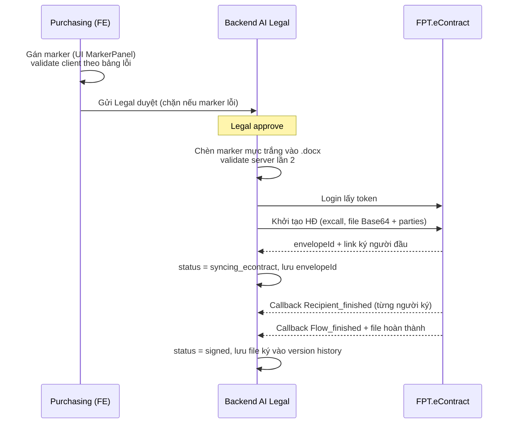

# 07 — Giải pháp tích hợp FPT.eContract & Marker ký số

> Owner: DEV (thiết kế) · BA (review nghiệp vụ) · Trạng thái: Draft — dựa trên 2 tài liệu chính thức trong `docs/`:
> - `Tài _liệu_API.pdf` — FPT.eContract Tài liệu đặc tả API (27 trang)
> - `Hướng-dẫn-cấu_trúc-đánh-dấu-marker.docx` — Mô tả cấu trúc marker
>
> Tính năng tích hợp eContract là **bắt buộc** của AI Legal (Sprint 1). Tài liệu này thay thế các giả định mock trước đây.

## 1. Tóm tắt spec FPT.eContract (đã đối chiếu tài liệu gốc)

### 1.1. Cú pháp marker

```
#<loại>:<id_marker> r:<recipientId> h:<chiều_cao> #
```

| Thành phần | Ý nghĩa | Ràng buộc |
|------------|---------|-----------|
| `ds:{id}` | Digital signature — chữ ký số | id **duy nhất** trong toàn file; mỗi người ký chỉ **1** marker chữ ký (lỗi `tooManyMarkerDigitalField`) |
| `is:{id}` | Image signature — ký ảnh | như trên |
| `st:{id}` | Text cần điền vào vị trí đánh dấu | trỏ tới recipient thật qua `r:` |
| `r:{recipientId}` | Định danh người ký trong luồng, dạng `p_001_r_001` | phải khớp luồng ký gửi trong API (lỗi `wrongFieldWithRole`) |
| `h:{n}` | Chiều cao ô ký | — |
| Khoảng cách `#…#` | Chiều rộng ô ký | — |

Ví dụ từ tài liệu: `#ds:id_1234 r:p_002_r_001 h:100 #`

**Lưu ý vận hành:** marker chèn vào file bằng **mực trắng** để không hiển thị với người đọc.

### 1.2. Mapping hình thức ký ↔ marker

| Hình thức ký | `signTypes` gửi API | Marker |
|--------------|---------------------|--------|
| Người xem xét (Review) | (role `reviewer`) | **Không có marker** |
| Ký điện tử (ký ảnh) | `Sign-IMG` | `is{id}` |
| Chữ ký số dài hạn pháp nhân — passcode | `sign_fca.passcode` | `ds{id}` |
| Ký số cấp 1 lần xác thực eKYC | `sign_ekyc`, `sign_fca.otp` | `ds{id}` |

### 1.3. Bốn API + callback

| # | API | Method/URL | Ghi chú |
|---|-----|-----------|---------|
| 1 | Login lấy token | `POST {ROOT}/v1/client-auth/login` — body `{username, password, clientid, clientsecret}` | trả `access_token` (Bearer) + `expTime` → backend phải cache & refresh |
| 2 | Khởi tạo HĐ theo file đánh dấu ô ký | `POST {ROOT}/services/excall/api/excall` — `selector: flow_start_..._create_auto_determine_econtract_integrate`, `lookup = refId` | body: `refId` (mã HĐ bên mình), `file` (Base64 **đã chèn marker**), `fileName`, `docTypeCode`, `headerFields[]` (envName/envNo…), `parties[]` → trả `envelopeId` + link ký người đầu tiên |
| 3 | Lấy lại link ký | `POST {ROOT}/services/envelope/api/external/v1/envelopes/recipient` — `{contactId, envelopeId}` | trả `envStatus`, `recipientStatus`, `webView` (link + cookie, hiệu lực 1800s) |
| 4 | Hủy HĐ đang xử lý | `POST {ROOT}/app/services/excall/api/excall` — `selector: flow_processing_..._cancel_contract`, `lookup = envelopeId` | body `{type:"sync", actList:[{envelopeId, reason}]}` |

Môi trường: Demo `https://demo.econtract.fpt.com/app` · Production `https://econtract.fpt.com/app`.

**Callback từ FPT** (tùy nghiệp vụ, FPT cấu hình): `Recipient_push_info` (thông báo ký) · `Recipient_finished` (trạng thái người ký) · `Flow_finished` (trạng thái HĐ + **file hoàn thành**).

### 1.4. Trạng thái & mã lỗi cần map

- Trạng thái HĐ: `Draft / Processing / Completed / Rejected / Voided / Overdue`.
- Trạng thái người ký: `Waiting|null / Processing / Accepted / Rejected`.
- Mã lỗi validate marker (tất cả code `13`): `isNotExistsMarkerField`, `tooManyMarkerDigitalField`, `wrongFieldWithRole`, `isNotExistsRecipientInfo`, `recipientRoleIsNull`, `isNotExistsIndividual` (thiếu orgName), `docTypeCodeIsNotExists`, `requestNotContainsRefId`.

## 2. Thiết kế tính năng trên hệ thống AI Legal

### 2.1. Luồng end-to-end



### 2.2. Mapping dữ liệu AI Legal → eContract

| AI Legal (`types.ts`) | eContract | Ghi chú |
|------------------------|-----------|---------|
| `review.code` | `refId` = `lookup` | mã tra cứu 2 hệ thống |
| `review.title` | `headerFields.envName` | |
| `review.code` | `headerFields.envNo` | |
| `SignRecipient.partyId/orgName/isMyOrg/order` | `parties[]` | orgName bắt buộc |
| `SignRecipient.id` (`p_001_r_001`) | `recipients[].recipientId` | |
| `SignRecipient.email/name/phone` | `email/personalName/telephoneNumber` | email bắt buộc |
| `SignRecipient.ecRole` | `role: signer\|reviewer` | |
| `SignRecipient.signType` | `signTypes[]` | mapping mục 1.2 |
| `SignRecipient.marker` | marker chèn trong file | id duy nhất, h, mực trắng |
| `review.status: syncing_econtract → signed` | `envStatus: Processing → Completed` | thêm map `Rejected/Voided/Overdue` — xem mục 4 |

### 2.3. Đã code trên FE demo (commit này)

| Hạng mục | File | Nội dung |
|----------|------|----------|
| Model recipient chuẩn eContract | `frontend/src/lib/types.ts` | `SignRecipient` thêm `partyId`, `orgName`, `isMyOrg`, `order`, `email`, `phone`, `ecRole`, `signType`, `refRecipientId`; type mới `EcontractSignType` |
| Cú pháp marker đúng spec | `frontend/src/lib/review-service.ts` → `buildMarkerSyntax` | `#ds:id r:p_001_r_001 h:100 #` (marker `st` trỏ `refRecipientId`) |
| Validate theo bảng mã lỗi FPT | `validateMarkers` | 8 luật: thiếu marker, trùng id, >1 marker chữ ký/người, sai loại vs hình thức ký, reviewer có marker, thiếu orgName/email/role, `st` không trỏ recipient, h ≤ 0 |
| Mapping hình thức ký | `markerTypeForSignType`, `recipientNeedsMarker` | review → không marker; sign_img → is; passcode/eKYC → ds |
| Sửa thông tin người ký | `updateRecipient` (mock + `PATCH /api/reviews/{id}/recipients/{rid}`) | đổi email/hình thức ký; đổi loại ký tự gỡ marker lệch loại |
| Gán marker có chiều cao | `assignMarker(id, recipientId, positionLabel, height)` | default h:100 theo ví dụ tài liệu |
| Dựng payload API khởi tạo HĐ | `buildEcontractPayload(review)` | đúng cấu trúc excall mục 3.1.2 (selector/lookup/body/parties) |
| UI MarkerPanel mới | `frontend/src/components/review/marker-panel.tsx` | nhóm theo bên ký (party), sửa email + hình thức ký, nhập h, hiển thị cú pháp marker, cảnh báo mực trắng, **preview JSON payload eContract** |
| Seed data chuẩn | `frontend/src/lib/mock-data.ts` | recipient dạng `p_001_r_001` với org/email/signType; marker st tham chiếu người ký thật; bump storage key v22 |

### 2.4. Backend phải làm (ngoài scope FE demo)

1. **Chèn marker vào `.docx`**: ghi text marker vào vị trí user chọn với font màu trắng (OOXML `w:color w:val="FFFFFF"`), trước khi encode Base64. Vị trí từ UI hiện là label — backend cần map label → vị trí thật trong tài liệu (hoặc nâng UI lên click-trên-preview, xem mục 4).
2. **Client credentials**: lưu an toàn `clientid/clientsecret/username/password` do FPT cấp; cache `access_token`, refresh trước `expTime`.
3. **Gọi API 3.1.2 khi Legal approve** (payload đúng như `buildEcontractPayload`); lưu `envelopeId` vào review.
4. **Callback endpoint** nhận `Recipient_push_info` / `Recipient_finished` / `Flow_finished`: cập nhật trạng thái, lưu file hoàn thành; **đối soát định kỳ** bằng API 3.1.3 phòng callback treo (rủi ro R5).
5. **Hủy HĐ**: khi Legal/Purchasing hủy review đã đẩy ký → gọi API 3.1.4 với `reason`.
6. **Retry + idempotency**: `refId` là khóa chống tạo trùng; mã lỗi ≠ 0 phải hiển thị message tiếng Việt từ bảng lỗi.

## 3. Việc kiểm thử bổ sung (nối vào `06-test-strategy.md`)

| TC | Kịch bản | Kỳ vọng |
|----|----------|---------|
| EC-01 | Recipient reviewer có marker | validate chặn `wrongFieldWithRole` |
| EC-02 | 2 marker `ds` cùng 1 recipient | chặn `tooManyMarkerDigitalField` |
| EC-03 | Thiếu orgName / email | chặn `isNotExistsIndividual` / `isNotExistsRecipientInfo` |
| EC-04 | signType sign_img nhưng marker ds | chặn `wrongFieldWithRole` |
| EC-05 | Marker st không trỏ recipient | chặn |
| EC-06 | Payload preview khớp schema mục 3.1.2 (refId=lookup, parties đủ trường) | so JSON |
| EC-07 | (BE) File Base64 có marker mực trắng, FPT demo env nhận và trả envelopeId | integration test môi trường Demo |
| EC-08 | (BE) Callback Flow_finished → status signed + file lưu | integration test |
| EC-09 | (BE) Hủy HĐ đang Processing | envStatus Voided |

## 4. Câu hỏi mở với FPT / nội bộ (bổ sung vào `02-open-questions.md` nhóm D)

| ID | Câu hỏi |
|----|---------|
| D1a | Giá trị `selector` chính thức cấp cho hệ thống mình (hiện placeholder `flow_start_AI_LEGAL_...`)? Tên "HỆ THỐNG KHÁCH HÀNG" trong selector là gì? |
| D1b | `docTypeCode` — danh sách mã loại tài liệu cấu hình trên portal FPT? Ai cấu hình headerFields trên portal? |
| D1c | Tài liệu API mô tả tạo HĐ theo **file PDF** đánh dấu ô ký, ví dụ request lại gửi `.docx` — FPT nhận `.docx` trực tiếp hay mình phải convert PDF trước khi gửi? Ảnh hưởng pipeline "giữ format". |
| D1d | Callback: FPT cần mình cung cấp endpoint gì (URL, auth, retry policy)? Có hỗ trợ sFTP nhận file ký như Rev12 mô tả không, hay chỉ callback? |
| D1e | Môi trường Demo: xin credentials (clientid/secret + account) để chạy integration test EC-07..09 trong Sprint 1. |
| D1f | UI gán vị trí marker: Sprint 1 dùng danh sách vị trí định sẵn (như demo) hay bắt buộc click-chọn-vị-trí trên preview tài liệu? (liên quan cách backend chèn marker vào đúng toạ độ) |

## 5. Định nghĩa hoàn thành tính năng (Sprint 1)

- FE: gán marker đúng cú pháp + validate đầy đủ bảng lỗi (✔ đã có trên demo).
- BE: đẩy HĐ sang FPT demo env thành công, nhận callback, status về `signed` với file hoàn thành.
- Test EC-01 → EC-09 pass; lỗi từ FPT hiển thị tiếng Việt cho user.
- Legal/Purchasing xác nhận luồng trên UAT.
